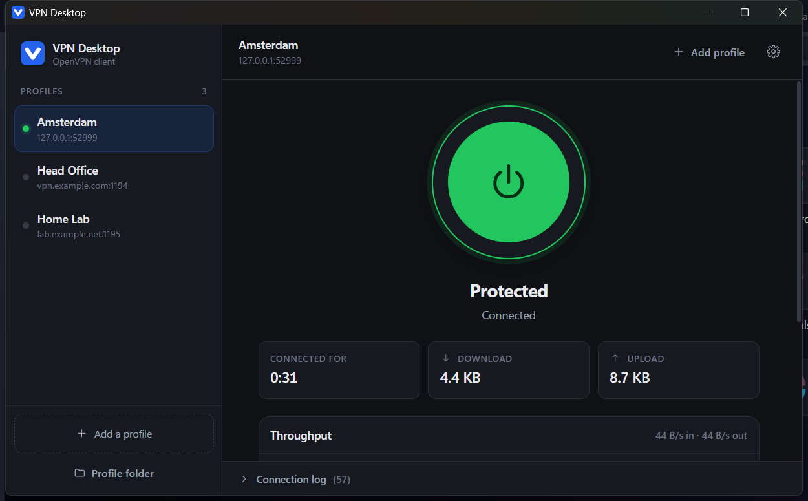
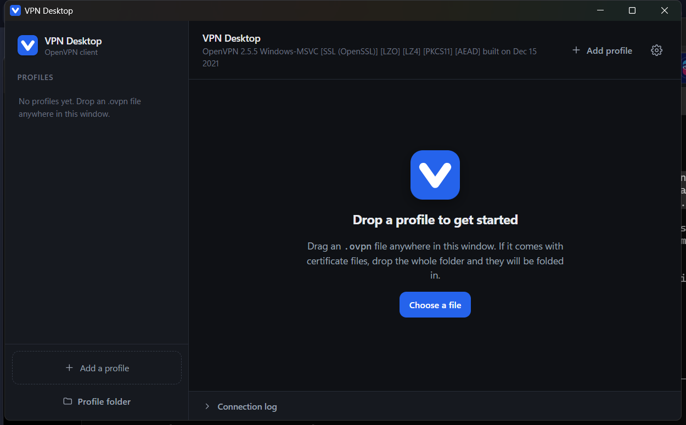
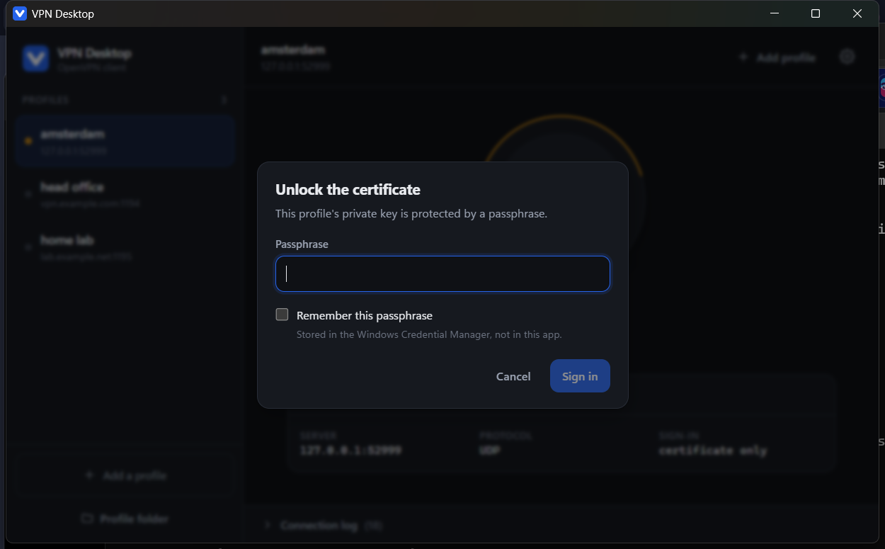
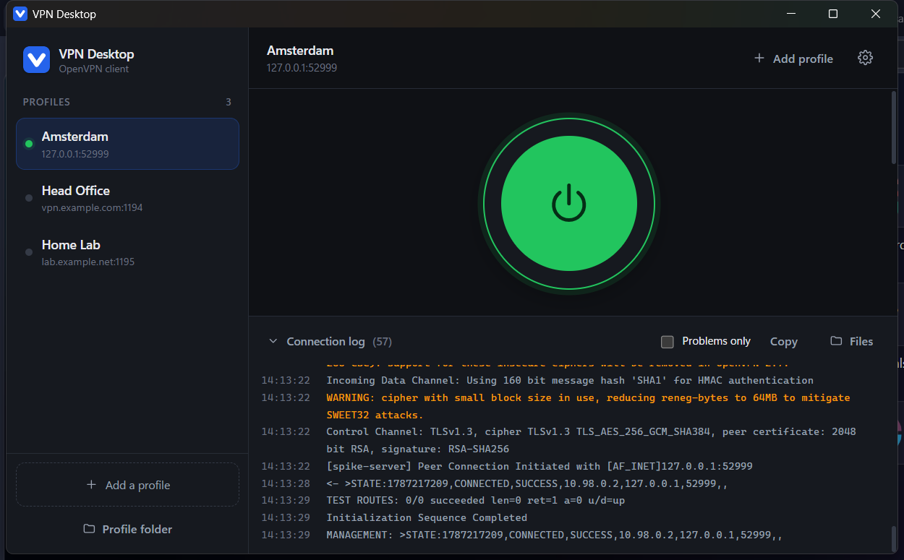
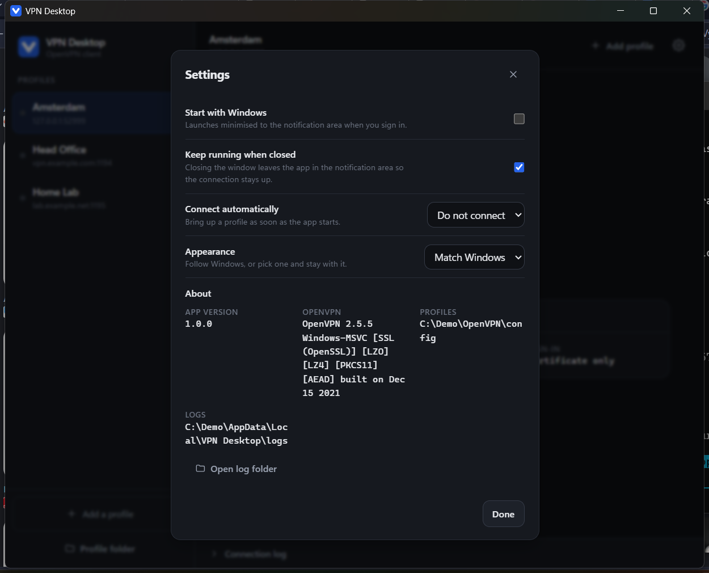

<div align="center">


# VPN Desktop

**A modern desktop client for OpenVPN.**
Drag a `.ovpn` file onto the window, click once to connect, and see what is
actually happening in plain language.

[](#project-status)
[](#requirements)
[](../../releases/latest)
[](LICENSE)

</div>

---

> ### This project is in active development
>
> v1.0.0 is a working, genuinely usable release - it has been verified by
> connecting real tunnels end to end - but it is an early one. Expect more
> features, changes and fixes. See [what is missing](#roadmap) before you rely on
> it for anything critical, and please [open an issue](../../issues) when
> something behaves badly.

---

## Why

The community OpenVPN GUI works, but it comes from a different era. Profiles are
managed by dropping files into a folder you have to find first, status is a
balloon tip, and when something goes wrong you get raw log text. That is fine if
you already know how OpenVPN works. It is not fine for everyone else.

VPN Desktop does **not** reimplement the VPN. `openvpn.exe` stays the tunnel
engine. This app is the profile manager, the connection controller and the status
surface around it: the part a person actually touches.

<div align="center">

</div>

## Features

**Profiles**

- **Drag and drop a `.ovpn` file** onto the window to import it. Or use *Add a
  profile* and pick the file, and the app creates the folder for you.
- **Certificates are folded in.** A profile that references `ca.crt`,
  `client.crt`, `client.key` or `ta.key` as sibling files gets them rewritten as
  inline blocks, so each profile becomes one self-contained, portable file.
- **Profiles you already have just appear.** Storage uses
  `%USERPROFILE%\OpenVPN\config\<name>\`, the same layout the community GUI
  uses, so an existing setup shows up with nothing to import.
- Rename, duplicate and delete, with the server and sign-in method shown for
  each profile at a glance.

**Connecting**

- **One click.** A single power dial that turns green when the tunnel is up.
- **Live status**: uptime, bytes in and out, and a throughput graph, straight
  from OpenVPN's own counters rather than guessed at.
- **Errors in plain language.** Fatal errors and authentication failures get
  translated into a sentence that says what to do, instead of a log line.
- **A readable log** with severity colouring, one click away and copyable, for
  when you do want the detail.

**Credentials**

- Username, password, private-key passphrase and **two-factor codes** (static
  and dynamic challenge/response) all handled.
- **Saved once, in the Windows Credential Manager**, never in a file on disk.
  Passwords and key passphrases are stored separately, so the app asks for
  exactly the one it needs.
- **A saved secret is used silently.** You are only asked again if it turns out
  to be wrong.
- **Credentials the community GUI already saved are imported automatically**, so
  switching over does not mean digging out passphrases you set up years ago.
- Blank passwords are supported, because plenty of certificate-plus-passphrase
  setups legitimately have one.

**Living in the tray**

- A tray icon that **shows a green badge while the tunnel is up**, so the state
  is visible without opening anything.
- Close the window and the app keeps running with the connection alive.
- Start with Windows, and optionally connect a chosen profile automatically.
- Light, dark, or follow Windows.

<div align="center">

<br>
<em>The tray icon at its real 16px size, magnified: idle, and connected.</em>
</div>

## Screenshots

<table>
<tr>
<td width="50%"></td>
<td width="50%"></td>
</tr>
<tr>
<td><b>Nothing imported yet</b><br>The whole window is a drop target.</td>
<td><b>Connected</b><br>Uptime and live byte counters.</td>
</tr>
<tr>
<td></td>
<td></td>
</tr>
<tr>
<td><b>Unlocking a certificate</b><br>Remember it and you are not asked again.</td>
<td><b>The log, when you want it</b><br>Severity-coloured and copyable.</td>
</tr>
<tr>
<td colspan="2" align="center"></td>
</tr>
<tr>
<td colspan="2" align="center"><b>Settings</b>: autostart, close-to-tray, auto-connect, appearance, and where everything lives on disk.</td>
</tr>
</table>

## Requirements

| | |
| --- | --- |
| **OS** | Windows 10 or 11, 64-bit |
| **OpenVPN** | 2.5 or later, with the **OpenVPN Interactive Service** installed and running (it is installed and enabled by default) |

### About OpenVPN

**VPN Desktop needs OpenVPN installed; it does not ship with it yet.**

Bundling the official OpenVPN installer so that one setup covers everything is
planned, and is the next thing on the [roadmap](#roadmap), but it is *not* in
v1.0.0. If OpenVPN is missing, the app says so on startup and names what to
install rather than failing silently.

Most Windows machines that have ever used a VPN already have it. To check, or to
install it:

1. Download the Windows installer from
   [openvpn.net/community-downloads](https://openvpn.net/community-downloads/).
2. Run it and keep the defaults. The defaults include the *OpenVPN Service* and
   the *Interactive Service*, which is what lets VPN Desktop connect **without a
   UAC prompt every time**.
3. That is all. You do not need to use the OpenVPN GUI it installs. VPN Desktop
   replaces it, and picks up any profiles and saved credentials it finds.

The tunnel itself is run by OpenVPN's own `openvpn.exe`. VPN Desktop launches
and controls it as a separate process; it does not link against it or replace any
part of it.

## Install and run

### The quick way (released build)

1. Make sure OpenVPN is installed. See [above](#about-openvpn).
2. Download `vpn-desktop-1.0.0-windows-amd64.zip` from the
   [latest release](../../releases/latest).
3. Unzip it anywhere: your Desktop, or `C:\Program Files\VPN Desktop`. There is
   no installer yet, just a single self-contained `.exe`.
4. Run **`openvpn-desktop.exe`**.

Windows shows a **SmartScreen** warning the first time, because this build is not
code-signed: click *More info*, then *Run anyway*. Signing is on the roadmap.

To have it start with Windows, turn on **Start with Windows** in Settings rather
than making a shortcut. That registers it to start minimised to the tray.

### First run

1. **Add a profile.** Drag a `.ovpn` file onto the window, or click *Add a
   profile* and choose the file. If you already had OpenVPN profiles, they are
   listed already.
2. **Pick it in the sidebar** and click the power dial.
3. **Enter credentials if asked**: a username and password, a certificate
   passphrase, a 2FA code, or nothing at all, depending on the profile. Tick
   *Remember* and you will not be asked next time.
4. The dial turns green and shows **Protected**. Close the window and the app
   stays in the tray with the tunnel up.

To disconnect, click the dial again, or use the tray menu.

### Where things are kept

| What | Where |
| --- | --- |
| Profiles | `%USERPROFILE%\OpenVPN\config\<name>\` |
| Logs | `%LOCALAPPDATA%\VPN Desktop\logs\` |
| Preferences | `%LOCALAPPDATA%\VPN Desktop\` |
| Passwords and passphrases | Windows Credential Manager, under `VPNDesktop:*` |

Settings has buttons that open the profile and log folders directly. Nothing
secret is written to a file: credentials only ever go to the OS vault.

### Build from source

Needs **Go 1.25+**, **Node 22+**, and the Wails v3 CLI.

```sh
go install github.com/wailsapp/wails/v3/cmd/wails3@latest

git clone https://github.com/MuhibAhmed/openvpn-desktop.git
cd openvpn-desktop

wails3 dev      # hot-reloading dev build
wails3 build    # produces bin/openvpn-desktop.exe
```

More detail, including the test suite, the layout, and hard-won notes on how the
Windows launch path actually behaves, is in
[docs/DEVELOPMENT.md](docs/DEVELOPMENT.md).

## Troubleshooting

**"OpenVPN was not found" on startup.**
OpenVPN is not installed, or not where the app looks. Install it from
[openvpn.net/community-downloads](https://openvpn.net/community-downloads/) with
the default options. Settings, under *About*, shows the version it detected.

**The connection sits on "Connecting" and nothing happens.**
Open the connection log; the last line usually names the cause. If the log is
empty too, the Interactive Service is probably not running: open *Services*
(`services.msc`) and check that **OpenVPN Interactive Service** is started. A
watchdog gives up after 45 seconds rather than hanging forever.

**"All TAP-Windows adapters on this system are currently in use."**
Another OpenVPN connection is already up, often the old GUI, still in the tray.
Disconnect it and try again.

**It asks for a passphrase every time.**
Tick *Remember* in the dialog. If it still asks, the stored secret is being
rejected: the app deliberately asks again when a saved secret turns out to be
wrong, so re-enter it once and it will stick.

**It asks for a password when my profile has none.**
Leave it blank and submit. Blank passwords are supported.

**Anything else.**
Settings, then *Open log folder*, and attach the newest log to an
[issue](../../issues). Logs contain server names and IP addresses but never
credentials: those are redacted before anything is written.

## Project status

Windows works end to end, verified by connecting real tunnels through the UI:
adapter opened, routes applied, live throughput, clean teardown.

| Area | State |
| --- | --- |
| Launching openvpn unelevated (Interactive Service) | done, verified |
| Management interface: state, log, throughput, credentials, 2FA | done, unit + integration tested |
| Profile import, inlining certificates, store | done, tested |
| UI: profile list, connect dial, stats, log drawer, settings | done |
| Credentials in Windows Credential Manager | done, verified against the real vault |
| Answering saved credentials without prompting | done, verified end to end |
| Importing credentials the OpenVPN GUI saved | done, verified end to end |
| System tray, tray badge, close-to-tray | done, verified |
| Launch on login, auto-connect | done, not yet exercised end to end |
| Branding: logo, favicon, app icon | done, verified at 16px |
| Bundling OpenVPN in an installer | **not started** |
| DNS control, split tunnelling, kill switch | **not started** |
| Code signing | **not started** |
| macOS | **not started** (the launcher already sits behind an interface) |

### Known limitations

- **Administrators group only.** Profiles live in `%USERPROFILE%\OpenVPN\config`,
  and for a standard user the Interactive Service will not accept a config from
  there. See [the launch-path notes](docs/windows-launch-path.md) for why, and
  what a standard-user build would need.
- **Loose `.ovpn` files in the config root are not listed.** Only subfolders are
  scanned. Import the file and the app puts it in its own folder.
- **No kill switch yet.** If the tunnel drops, traffic falls back to your normal
  connection. Do not assume you are protected during a reconnect.
- **Unsigned**, so SmartScreen complains on first run.
- **Windows only** so far.

## Roadmap

Roughly in the order they are likely to happen:

1. **An installer that bundles OpenVPN**, so a single setup covers everything and
   the requirement above disappears.
2. **DNS control and a kill switch**: `--block-outside-dns`, and dropping the
   default route on an unexpected disconnect with an unmistakable banner.
3. **Split tunnelling** per profile.
4. **Standard-user support**, so membership of the Administrators group stops
   being a requirement.
5. **Code signing**, to get rid of the SmartScreen warning.
6. **macOS**, via a bundled binary and a privileged helper.

## Contributing

Issues and pull requests are welcome. Two things worth reading first:

- [docs/DEVELOPMENT.md](docs/DEVELOPMENT.md): how to build, and how the tests
  cover the connection state machine without needing a VPN or a server.
- [docs/windows-launch-path.md](docs/windows-launch-path.md): the behaviour of
  the OpenVPN management interface that this app depends on. All of it was
  established by observation rather than from documentation, and several rules in
  there will cost you an afternoon if you have not read them.

Run `go test ./internal/...` before opening a pull request. The state machine,
the parser, the profile store and the credential vault are all covered.

## Licence

VPN Desktop is released under the [MIT licence](LICENSE).

OpenVPN itself is separate: it is GPLv2, and "OpenVPN" is a trademark of OpenVPN
Inc. This app drives the `openvpn` binary as a separate process and does not link
against it, so the two licences do not mix. Before OpenVPN is bundled into an
installer, the GPLv2 obligations for redistributing that binary (licence text and
an offer of source) will need to be met, and the product name checked against the
trademark. This project is not affiliated with or endorsed by OpenVPN Inc.
